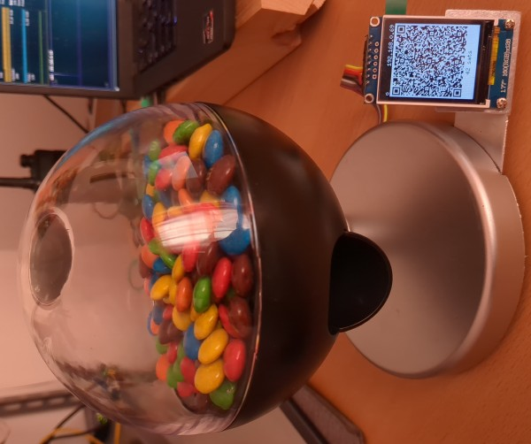

# CandyPi - Lightning-Paid Candy Dispenser



A Rust application for a Raspberry Pi Zero 2 W that displays QR codes on an ST7735 LCD display and controls a motor for dispensing candy.

## Hardware Setup

### Display Wiring (ST7735 LCD)
- LED → GPIO 22 (pin 15)
- SCK → GPIO 11 SCLK (pin 23)
- SDA → GPIO 10 MOSI (pin 19)
- A0 (DC) → GPIO 24 (pin 18)
- RESET → GPIO 25 (pin 22)
- CS → GPIO 8 CE0 (pin 24)
- GND → Ground (pin 9)
- VCC → 3.3V (pin 1)

### Motor
- Motor control → GPIO 4

## Features
- Displays a lightning invoice QR code generated by a local [Fedimint](https://github.com/fedimint/fedimint) wallet
- Displays IP in local network for easier remote access
- Turns motor for a specific amount of timt (0.5s right now) on payment to dispense candy
- Shows payment success on screen

## Building

### Option 1: Cross-compile with Nix (Recommended)
While this requires setting up [`boot.binfmt.emulatedSystems`](https://search.nixos.org/options?channel=25.05&show=boot.binfmt.emulatedSystems&query=emulatedSystems) and is rather slow due to emulation, this is the preferrable way to build in my experience since at least you can use all the system memory and aren't limited by a RaspberryPi. If you have a large ARM64 build server that would obviously be the preferable choice.

```bash
# Build installable ARM64 .deb for Raspberry Pi
nix bundle --system aarch64-linux --bundler bundlers#toDEB

# Copy over result
scp scp deb-single-candypi/candypi_0.1.0_arm64.deb user@your-pi-address

# Install on pi
sudo dpkg --install candypi_0.1.0_arm64.deb

# Run installed binary, you need to be root or add your user to the gpio group
candypi
```

### Option 2: Build natively on Raspberry Pi
```bash
cargo build --release
./target/release/candypi
```

